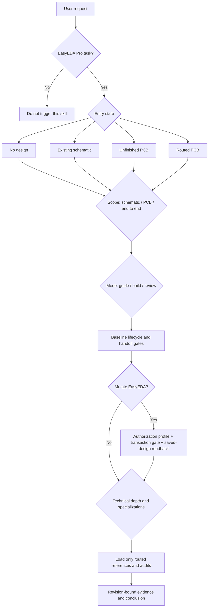

# EasyEDA PCB Design Skill

**English** · **[中文](README.zh-CN.md)**

This Agent Skill guides, creates, continues, modifies, and reviews schematic and PCB designs in **EasyEDA Pro**. It supports ordinary boards as well as controlled-impedance, high-speed, RF, BGA/HDI, mixed-signal, and manufacturing-review work.

The skill is deliberately a router rather than one large PCB manual. `SKILL.md` first identifies the design's starting state, requested scope, desired outcome, authorization boundary, and technical depth. It then loads only the relevant workflow, specialization, and evidence rules from `references/`. A simple board does not inherit an unnecessary high-speed process, while a high-risk design cannot claim fabrication readiness from a basic DRC pass.

> **Boundary:** This skill is for EasyEDA Pro, not KiCad, Altium, OrCAD, or other EDA tools. No audit result authorizes fabrication, ordering, or payment.

## Installation

Copy this prompt into an Agent that supports local Skills:

```text
Install `skills/easyeda-pcb-design/` from this workspace as an Agent Skill.

Requirements:
1. Install only `skills/easyeda-pcb-design/`; its entry point is `SKILL.md`.
2. Confirm that the skill name `easyeda-pcb-design` is available and explain how to invoke it.
3. Do not copy repository-level README files, AGENTS.md, or designs/ into the skill installation.
4. If I want the Agent to operate EasyEDA directly, also check whether the companion `easyeda-api` skill and local bridge are ready.
```

Architecture guidance and review of supplied artifacts do not require a live EasyEDA connection. Creating or modifying a design inside EasyEDA requires the companion `easyeda-api` skill and a reachable local bridge. The Agent must never invent an API.

## Usage

Describe the intended outcome, the artifacts that already exist, and how far the Agent should proceed. When product-defining information is missing, the skill resolves requirements and primary functions before drawing the board.

```text
Use easyeda-pcb-design to create an STM32 sensor board from scratch, including the schematic and PCB.
```

```text
Review the current schematic for electrical correctness and PCB handoff readiness. Do not start the PCB.
```

```text
Continue the unfinished PCB. Preserve the existing routes and complete only the remaining placement, routing, and copper.
```

```text
Review whether this routed USB 3.x board has enough evidence for fabrication.
```

## Routing model

The router resolves five dimensions in order:

1. **Entry state** — what design artifacts already exist;
2. **Scope** — schematic only, PCB only, or end to end;
3. **Mode** — guidance, implementation/modification, or review/release;
4. **Transaction and authorization** — whether EasyEDA will be mutated and which changes are authorized;
5. **Technical depth** — baseline, controlled/high-speed, or high-risk signal integrity.

Only then does it load the required references and audit tools.



These dimensions are not an arbitrary menu of combinations. **PCB only** requires a valid schematic handoff or an already bound PCB. A routed-board repair that changes component identity or net binding must return to the schematic and handoff path. A fabrication-readiness question cannot be answered from a schematic-only review. Missing upstream conditions route the task back to the corresponding gate.

### 1. Route by entry state

| Entry state | Route | Key boundary |
| --- | --- | --- |
| No existing design | **New construction**, beginning with requirements, architecture, and primary functions | Advance only through the user-requested scope; do not assume an end-to-end build |
| Existing schematic | Schematic review/modification, or close the handoff before PCB creation | Production PCB creation, placement, and routing require a closed handoff |
| Unfinished PCB | **Existing-board continuation**, bound to the current revision and resumed at the first incomplete phase | Do not replay initial construction or misclassify unfinished work as repair |
| Routed PCB | Read-only review or **existing-board repair** | Changes to identity, population, footprint/pad mapping, or net binding must return through schematic handoff |

The authoritative rules are in [`entry-routing.md`](skills/easyeda-pcb-design/references/workflows/entry-routing.md). Classification uses the actual document UUIDs, population, synchronization state, unrouted connectivity, tracks, vias, pours, and DRC—not the project filename.

### 2. Bound the scope

| Scope | Included | Explicit stopping point |
| --- | --- | --- |
| **Schematic only** | Requirements, architecture, part selection, schematic work, ERC, and handoff readiness | No PCB creation, placement, routing, or manufacturing-readiness claim |
| **PCB only** | Synchronization, constraints, placement, routing, copper, DRC, mechanics, and requested manufacturing review, starting from a handoff or bound PCB | Do not silently redesign the schematic; cross-scope changes return through handoff |
| **End to end** | Complete the schematic workflow, close handoff, then run the PCB workflow | PCB implementation cannot start before handoff closes |

An explicit “schematic only” request must stop at that boundary. Any fabrication- or order-readiness question is treated as an end-to-end formal review because manufacturing readiness cannot be inferred from one document.

### 3. Select the mode from the requested outcome

| Mode | Behavior |
| --- | --- |
| **Guide** | Develop requirements, architecture, constraints, or tradeoffs and provide the next concrete design action; ordinary guidance does not use PASS/FAIL language |
| **Build or modify** | Implement approved choices in dependency order and verify each completed phase |
| **Review or release** | Inspect the exact revision and declared scope, run applicable audits, and explain findings, evidence, assumptions, exclusions, and the next action |

A request may span modes, but the sequence remains: make design decisions, implement them, then review the result.

### 4. Load the baseline lifecycle

Every task reads the entry router, then loads the lifecycle required by its scope:

| Task | Required entry point |
| --- | --- |
| Any task | [`entry-routing.md`](skills/easyeda-pcb-design/references/workflows/entry-routing.md) |
| Schematic creation, modification, or schematic review | [`schematic-workflow.md`](skills/easyeda-pcb-design/references/workflows/schematic-workflow.md) |
| PCB creation, continuation, repair, or PCB review | [`pcb-workflow.md`](skills/easyeda-pcb-design/references/workflows/pcb-workflow.md) |
| PCB placement and routing | Also load [`constraint-planning.md`](skills/easyeda-pcb-design/references/layout/constraint-planning.md) and [`layout-rules.md`](skills/easyeda-pcb-design/references/layout/layout-rules.md) |
| End-to-end work | Run the schematic workflow first, close schematic-to-PCB handoff, then load the PCB workflow |

Two gates shape the lifecycle:

- **Requirements and primary functions:** Power input, programming, external interfaces, radio/antenna, controls, indicators, expansion, and test access must be confirmed, explicitly delegated, or recorded as unresolved. A convenient library part must not silently decide a product feature.
- **Schematic-to-PCB handoff:** Bind the current schematic revision, netlist/ERC, part and parameter evidence, symbol-to-pad mapping, footprints, critical nets, mechanics, and PCB-facing constraints. Any material change makes the previous handoff stale.

### 5. Route live mutations through authorization and transaction gates

Any write to EasyEDA additionally loads [`live-build-gates.md`](skills/easyeda-pcb-design/references/workflows/live-build-gates.md) and [`api-map.md`](skills/easyeda-pcb-design/references/api/api-map.md), then runs:

```bash
node skills/easyeda-pcb-design/scripts/live/check_companion.mjs
```

Work may continue only when the command exits with code `0` and reports `ready: true`. Project and document UUIDs are bound before writes. Every operation is awaited, and semantic readback from the saved and reopened design is authoritative.

Production routing and destructive repair additionally require a schema-2 timed operation log, a `CONTINUE` execution-budget result, a schema-3 placement report proving native board-material containment, and a native `.epro` checkpoint proven by a separate probe restore. Route and repair operations are declared as JSON plans and executed through the shared transaction runners; a gate advances only after saved/reopened current-state and repeated detailed-DRC verification.

Authorization profile and transaction type are separate routing dimensions:

- **USER_OWNED** is the default. Destructive or bulk operations—such as deletion, mass net changes, broad synchronization/overwrite, or a copper rebuild that could discard work—require operation-specific confirmation.
- **AI_DEDICATED** applies only when the user explicitly declares the current project/revision AI-controlled or grants full project design authority. Standing authorization covers ordinary project-local mutations, but never removes UUID binding, snapshots, readback, netlist parity, DRC, or exact-revision evidence.

The transaction is then classified as **new construction**, **existing-schematic modification**, **existing-board continuation**, or **existing-board repair**. Neither authorization profile permits deleting the only recoverable revision, publishing/sharing a project, calling a manufacturing order API, or making a payment.

### 6. Add technical-depth and specialist routes

The baseline lifecycle always remains active. Specialist references are added only when their trigger applies:

| Trigger | Additional route |
| --- | --- |
| Ordinary MCU, sensor, control, or low-speed board | **Baseline** only; do not load high-speed material |
| Schematic readability, labels/ports, or handoff presentation | [`schematic-presentation.md`](skills/easyeda-pcb-design/references/workflows/schematic-presentation.md) |
| Part selection, exact MPNs, source evidence, library binding, or substitutes | [`component-selection-evidence.md`](skills/easyeda-pcb-design/references/workflows/component-selection-evidence.md) + [`component-parameter-profiles.md`](skills/easyeda-pcb-design/references/workflows/component-parameter-profiles.md) |
| Placement, routing, copper, and assembly closure | [`placement-closure.md`](skills/easyeda-pcb-design/references/layout/placement-closure.md) plus the baseline layout references |
| Differential pairs, target impedance, USB 2.0, Ethernet, LVDS, or fast-edge transmission-line behavior | [`high-speed-workflow.md`](skills/easyeda-pcb-design/references/high-speed/high-speed-workflow.md) + [`impedance-and-vias.md`](skills/easyeda-pcb-design/references/high-speed/impedance-and-vias.md) |
| USB 3.x, PCIe, DDR, multi-gigabit, RF launch, dense escape, solver, eye, or S-parameter work | **High-risk SI** path; baseline audits cannot replace specialist evidence |
| One named high-speed interface | Read only the matching section of [`protocol-profiles.md`](skills/easyeda-pcb-design/references/high-speed/protocol-profiles.md) |
| High-speed constraints audit | [`high-speed-constraints.md`](skills/easyeda-pcb-design/references/high-speed/high-speed-constraints.md) |
| Switching regulator or power stage | [`power-layout.md`](skills/easyeda-pcb-design/references/layout/power-layout.md) |
| ADC, DAC, reference, or mixed-signal partition | [`mixed-signal-layout.md`](skills/easyeda-pcb-design/references/layout/mixed-signal-layout.md) |
| Layer count, materials, stackup, or reference assignment | [`stackup-planning.md`](skills/easyeda-pcb-design/references/layout/stackup-planning.md) |
| BGA, HDI, fine-pitch escape, or via-in-pad | [`bga-hdi.md`](skills/easyeda-pcb-design/references/specialized/bga-hdi.md) |
| Crystal or resonator loop | [`crystal-clock-audit.md`](skills/easyeda-pcb-design/references/specialized/crystal-clock-audit.md) |
| Integrated-module or host-board PCB antenna | [`onboard-antenna.md`](skills/easyeda-pcb-design/references/specialized/onboard-antenna.md) |
| PDN, ESD, or EMC claim | [`pdn-emc.md`](skills/easyeda-pcb-design/references/specialized/pdn-emc.md) |
| PCB DRC evidence closure | [`drc-evidence-closure.md`](skills/easyeda-pcb-design/references/workflows/drc-evidence-closure.md) |
| Gerber/drill, BOM, PnP, and manufacturing regression | [`manufacturing-output.md`](skills/easyeda-pcb-design/references/api/manufacturing-output.md) |
| Edge-rate, trace-resistance, or skin-depth screening | [`screening-calculations.md`](skills/easyeda-pcb-design/references/supporting/screening-calculations.md); results are estimates |
| Request for a complete cross-domain example | [`worked-example-constraint-driven-board.md`](skills/easyeda-pcb-design/references/supporting/worked-example-constraint-driven-board.md) |

Uncertainty must not be resolved by downgrading the technical depth. Conversely, a confirmed baseline board should not load the full high-speed corpus. A guidance question does not automatically load audit implementation details.

## How audits enter the route

Audits close a relevant phase or answer a formal review question. They are not run indiscriminately on every request.

- The baseline audit is limited to the active document and declared scope.
- Placement audit runs after placement and again after any component, footprint, pad, via, interface, process, or access change that invalidates it.
- Crystal, high-speed, stackup, constraint, and manufacturing-output work uses the corresponding specialist tool.
- Every report is bound to an exact revision. A design or rule change stales dependent evidence.
- A clean DRC, a passing script, or a geometry check cannot alone prove electrical, mechanical, SI, EMC, or manufacturing intent.

Formal review first loads [`review-checklist.md`](skills/easyeda-pcb-design/references/workflows/review-checklist.md). Only fabrication/order-readiness questions use the controlled conclusions `PASS WITH DOCUMENTED ASSUMPTIONS/EXCEPTIONS`, `FAIL`, or `UNVERIFIED FOR FABRICATION`. Even a PASS does not authorize fabrication or ordering.

## Complete routing examples

### Build an ordinary MCU board from scratch

`No design → End to end → Build → New construction → Baseline`

Establish the requirements and primary-function baseline, complete the schematic and handoff, then proceed through PCB constraints, placement, routing, copper, and verification. Do not load high-speed specializations.

### Review only an existing schematic

`Existing schematic → Schematic only → Review`

Review electrical intent, parts, ERC, and handoff readiness. The conclusion explicitly excludes PCB placement, routing, copper, mechanics, and manufacturing outputs.

### Continue an unfinished PCB

`Unfinished PCB → PCB only → Build → Existing-board continuation`

Bind the current revision, confirm handoff/synchronization, baseline existing geometry and DRC, then continue only the declared incomplete work without rebuilding committed routes.

### Review a USB 3.x board for fabrication evidence

`Routed PCB → End-to-end formal review → High-risk SI`

In addition to schematic, PCB, DRC, and manufacturing outputs, the review requires high-speed evidence matching the current project, design, and constraint fingerprints. Missing design files, constraints, outputs, or specialist evidence leaves the conclusion `UNVERIFIED FOR FABRICATION`.

## Repository layout

```text
.
├── README.md                     # Primary English overview and routing guide
├── README.zh-CN.md               # 中文说明
├── AGENTS.md                     # Repository development and maintenance rules
└── skills/easyeda-pcb-design/    # Complete, independently installable skill
    ├── SKILL.md                  # Decision and routing entry point
    ├── agents/openai.yaml        # Agent display metadata and default prompt
    ├── references/
    │   ├── workflows/            # Lifecycles, handoff, live gates, and review
    │   ├── layout/               # Constraints, stackup, placement, routing, power, mixed signal
    │   ├── high-speed/           # High-speed workflow, impedance, protocols, audit constraints
    │   ├── specialized/          # BGA/HDI, crystals, antennas, PDN/EMC
    │   ├── api/                  # Live API and manufacturing-output boundaries
    │   └── supporting/           # Calculations, sources, and worked example
    └── scripts/                  # Repeatable checks, audits, and calculators
        ├── audits/               # Design, placement, high-speed, netlist, manufacturing audits
        ├── calc/                 # Analytical calculators and tests
        ├── lib/                  # Shared audit helpers and geometry utilities
        ├── lints/                # Baseline, component, constraint, and stackup lints
        ├── live/                 # Companion, identity, revision, snapshot, and gate-ledger checks
        └── tests/                # Cross-script regression suite
```

`skills/easyeda-pcb-design/` is the installation boundary. Repository-level files and local `designs/` projects are not part of the skill and must not be copied into an installation.

## Maintenance principles

- Keep `SKILL.md` focused on routing, boundaries, formal output contracts, and regression commands; keep detailed rules in directly linked references.
- Give each rule one authoritative home. This README explains the model instead of duplicating implementation semantics.
- Preserve progressive disclosure: references are directly routed, and long references provide a Contents section.
- Put deterministic, repeatable checks in `scripts/`; write generated evidence into the matching design directory rather than the repository root.
- Documentation simplification must not weaken the human fabrication boundary, high-risk-operation authorization, snapshot/readback requirements, or exact-revision evidence binding.

[`SKILL.md`](skills/easyeda-pcb-design/SKILL.md) is authoritative for runtime behavior.
