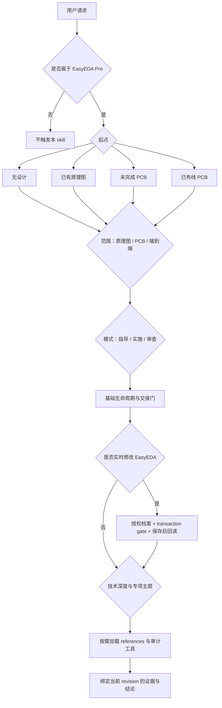

# EasyEDA PCB Design Skill

**[English](README.md)** · **中文**

这是一个面向 **嘉立创 EDA 专业版（EasyEDA Pro）** 的 Agent Skill。它可以指导、创建、续作、修改和审查原理图与 PCB，并根据设计风险只加载当前任务需要的规则、工具和证据流程。

它不是一份一次性塞给 Agent 的 PCB 大手册。`SKILL.md` 是路由入口：先判断任务从哪里开始、做到哪里、要什么结果，再按需读取 `references/` 中的工作流和专项规则。这样，普通板不会被高速设计流程拖累，高风险设计也不会只做一次基础 DRC 就宣称可以投板。

> **边界：** 这个 skill 只适用于 EasyEDA Pro，不适用于 KiCad、Altium、OrCAD 等工具。任何审计结果都不是下单、付款或生产授权。

## 安装

把下面这段话复制给支持本地 Skill 的 Agent：

```text
请把当前工作区里的 `skills/easyeda-pcb-design/` 安装为可用的 Agent Skill。

要求：
1. 只安装 `skills/easyeda-pcb-design/`，入口是其中的 `SKILL.md`。
2. 安装后确认 skill 名称 `easyeda-pcb-design` 可用，并说明如何唤起。
3. 不要把仓库级 README、AGENTS.md 或 designs/ 复制进 skill 安装目录。
4. 如果我要让 Agent 直接操作 EasyEDA，请同时检查配套 `easyeda-api` skill 和本地 bridge 是否就绪。
```

只做方案讨论或阅读已有资料时，不需要连接 EasyEDA。要让 Agent 在 EasyEDA 中实际创建或修改设计，则必须有配套的 `easyeda-api` 和可用的本地 bridge；Agent 不得臆造 API。

## 如何使用

直接描述目标、现有材料和希望做到的范围。信息不完整时，skill 会先收敛需求和关键产品功能，而不是直接开始画板。

```text
用 easyeda-pcb-design，从零做一块 STM32 传感器板，完成原理图和 PCB。
```

```text
审查当前原理图，只检查电气设计和 PCB 交接条件，不要开始 PCB。
```

```text
继续当前未完成的 PCB：保留已有布线，只完成剩余布局、走线和铺铜。
```

```text
检查这块已布线的 USB 3.x 板是否具备投板证据。
```

## 路由总览

路由不是只选一个文件，而是依次确定五个维度：

1. **起点（entry state）**：现在已经有什么设计；
2. **范围（scope）**：只做原理图、只做 PCB，还是端到端；
3. **模式（mode）**：指导、实施修改，还是审查发布；
4. **操作与授权（transaction / authorization）**：是否要写入 EasyEDA，以及允许改到什么程度；
5. **技术深度（technical depth）**：基础、受控阻抗/高速，或高风险 SI。

随后才加载对应工作流、专题规则和审计脚本。



这五个维度不是可以任意组合的菜单。比如 **PCB only** 必须有有效的原理图交接或已绑定的 PCB；已布线板一旦要改器件身份或网络绑定，就不能继续留在 repair 分支；制造就绪问题也不能只审查原理图。缺少上游条件时，路由会退回相应的前置门。

### 1. 先按设计起点分流

| 起点 | 路由 | 关键限制 |
| --- | --- | --- |
| 没有现成设计 | **new construction**：从需求、架构和主要功能开始 | 只推进到用户要求的范围，不默认做完整端到端设计 |
| 已有原理图 | 原理图审查/修改，或先关闭交接门再创建 PCB | 未完成交接前不能进入生产 PCB 创建、布局或布线 |
| 未完成 PCB | **existing-board continuation**：绑定现有版本，从第一个未完成环节续作 | 不重放初始建板，也不把“继续完成”误当成“修复” |
| 已布线 PCB | 只读审查，或 **existing-board repair** | 若变更触及器件身份、封装/焊盘映射或网络绑定，必须退回原理图和交接流程 |

权威规则在 [`entry-routing.md`](skills/easyeda-pcb-design/references/workflows/entry-routing.md)。判断起点依赖实际文档状态、UUID、器件、未布网络、走线、过孔、铺铜和 DRC，而不是工程文件名。

### 2. 再限定工作范围

| 范围 | 包含 | 明确停止点 |
| --- | --- | --- |
| **Schematic only** | 需求、架构、器件选择、原理图、ERC、交接准备 | 不创建 PCB，不布局、布线或推断制造就绪 |
| **PCB only** | 从已交接的原理图或已绑定 PCB 开始，完成同步、约束、布局、布线、铜皮、DRC 和请求内的制造检查 | 不静默修改原理图意图；跨范围变更必须返回交接门 |
| **End to end** | 先完整走原理图，再关闭交接门，然后进入 PCB | 原理图交接未关闭时不能抢跑到 PCB |

用户明确说“只检查原理图”时，skill 必须停在原理图范围。用户问“能否投板/下单”时，则自动视为端到端正式审查，因为制造结论不能从单一文档推出。

### 3. 根据结果选择工作模式

| 模式 | 行为 |
| --- | --- |
| **Guide** | 梳理需求、架构、约束或权衡，并给出下一步具体动作；普通讨论不输出 PASS/FAIL |
| **Build or modify** | 按依赖顺序实施已批准的选择，每完成一个阶段就验证相应结果 |
| **Review or release** | 审查精确版本和声明范围，运行适用审计，按严重度解释发现、证据、假设和下一步 |

一个请求可以跨模式，但顺序始终是：先设计决策，再实施，最后审查。

### 4. 基础生命周期路由

所有任务先读取入口路由，再根据范围加载生命周期：

| 任务 | 必读入口 |
| --- | --- |
| 任意任务 | [`entry-routing.md`](skills/easyeda-pcb-design/references/workflows/entry-routing.md) |
| 原理图创建、修改或原理图审查 | [`schematic-workflow.md`](skills/easyeda-pcb-design/references/workflows/schematic-workflow.md) |
| PCB 创建、续作、修复或 PCB 审查 | [`pcb-workflow.md`](skills/easyeda-pcb-design/references/workflows/pcb-workflow.md) |
| PCB 布局布线 | 再加载 [`constraint-planning.md`](skills/easyeda-pcb-design/references/layout/constraint-planning.md) 和 [`layout-rules.md`](skills/easyeda-pcb-design/references/layout/layout-rules.md) |
| 端到端 | 先走原理图工作流，关闭 schematic-to-PCB handoff，再加载 PCB 工作流 |

生命周期中的两个重要门：

- **需求与主要功能门**：电源入口、编程方式、外部接口、射频/天线、控制指示、扩展测试等主要产品功能必须被确认、明确委托或标记为未决；库里恰好有什么器件不能替用户做产品决策。
- **原理图到 PCB 交接门**：绑定当前原理图 revision、网表/ERC、物料与参数证据、symbol-to-pad 映射、封装、关键网络、机械与 PCB 约束。任何影响这些内容的变更都会让旧交接失效。

### 5. 实时修改使用独立的授权与 transaction 路由

只要要写入 EasyEDA，就额外加载 [`live-build-gates.md`](skills/easyeda-pcb-design/references/workflows/live-build-gates.md) 与 [`api-map.md`](skills/easyeda-pcb-design/references/api/api-map.md)，并先运行：

```bash
cd designs/<board-slug>
node ../../skills/easyeda-pcb-design/scripts/live/check_companion.mjs
```

只有退出码为 `0` 且结果包含 `ready: true` 才能继续。写入前绑定工程和文档 UUID；每个操作都要等待完成，并以保存、重新打开后的语义回读为准。

生产布线与破坏性修复还必须具备 schema-2 带时间戳操作日志、证明原生板材边界包含关系的 schema-3 布局报告，以及通过独立探针恢复验证的原生 `.epro` 检查点。每个实时命令都必须自行选择工程内报告路径并追加带工具归属的日志；`--output` 与 `--operation-log` 只用于可选覆盖。事务 plan 根据 `transactionId` 推导 before、after、result 和 verification 路径，Agent 绝不手写日志。耗时只记录和汇总，不控制是否继续执行。[实时 tools 库](skills/easyeda-pcb-design/references/api/tool-library.md)暴露 14 个稳定命令：schema-2 事务工具覆盖原理图元件/导线写入，以及 PCB 布线、修复、布局、板框和铜皮。只有保存重开后的当前状态、精确 delta/residue 与身份校验、适用的 containment 和重复 ERC/DRC 均验证通过，才能推进 gate。

授权档案和 transaction 是两个不同维度：

- **USER_OWNED**（默认）：删除、批量网络变更、整体覆盖/同步、可能丢失工作的铜皮重建等操作，需要针对具体操作获得确认。
- **AI_DEDICATED**：只有用户明确说明当前工程/版本由 AI 控制，或授予完整工程设计权限时才启用；普通工程内设计操作可使用持续授权，但仍不能跳过 UUID 绑定、快照、回读、网表一致性、DRC 和 revision 证据。

实时写入再按实际事务选择 **new construction**、**existing-schematic modification**、**existing-board continuation** 或 **existing-board repair**。无论哪种授权，都不允许删除唯一可恢复版本、发布/分享工程、调用制造下单接口或付款。

### 6. 最后叠加技术深度和专项规则

基础生命周期始终存在，专项规则只在命中条件时追加：

| 条件 | 追加加载 |
| --- | --- |
| 普通 MCU、传感器、控制或低速板 | **Baseline**；不加载高速材料 |
| 原理图可读性、标签/端口或交接展示 | [`schematic-presentation.md`](skills/easyeda-pcb-design/references/workflows/schematic-presentation.md) |
| 选型、精确 MPN、资料来源、库绑定或替代料 | [`component-selection-evidence.md`](skills/easyeda-pcb-design/references/workflows/component-selection-evidence.md) + [`component-parameter-profiles.md`](skills/easyeda-pcb-design/references/workflows/component-parameter-profiles.md) |
| 放置、布线、铜皮及装配闭环 | [`placement-closure.md`](skills/easyeda-pcb-design/references/layout/placement-closure.md) 及基础 layout references |
| 差分对、目标阻抗、USB 2.0、Ethernet、LVDS 或快速边沿传输线问题 | [`high-speed-workflow.md`](skills/easyeda-pcb-design/references/high-speed/high-speed-workflow.md) + [`impedance-and-vias.md`](skills/easyeda-pcb-design/references/high-speed/impedance-and-vias.md) |
| USB 3.x、PCIe、DDR、多 Gb/s、RF launch、密集逃逸或需要仿真/眼图/S 参数 | **High-risk SI** 路径；不能用基础审计替代专项证据 |
| 指定高速接口 | 只读取 [`protocol-profiles.md`](skills/easyeda-pcb-design/references/high-speed/protocol-profiles.md) 中对应接口章节 |
| 高速约束审计 | [`high-speed-constraints.md`](skills/easyeda-pcb-design/references/high-speed/high-speed-constraints.md) |
| 开关电源 | [`power-layout.md`](skills/easyeda-pcb-design/references/layout/power-layout.md) |
| ADC、DAC、基准源或混合信号 | [`mixed-signal-layout.md`](skills/easyeda-pcb-design/references/layout/mixed-signal-layout.md) |
| 层数、材料、叠层或参考层选择 | [`stackup-planning.md`](skills/easyeda-pcb-design/references/layout/stackup-planning.md) |
| BGA、HDI、细间距逃逸或 via-in-pad | [`bga-hdi.md`](skills/easyeda-pcb-design/references/specialized/bga-hdi.md) |
| 晶体/谐振器回路 | [`crystal-clock-audit.md`](skills/easyeda-pcb-design/references/specialized/crystal-clock-audit.md) |
| 模组天线或主板 PCB 天线 | [`onboard-antenna.md`](skills/easyeda-pcb-design/references/specialized/onboard-antenna.md) |
| PDN、ESD 或 EMC 结论 | [`pdn-emc.md`](skills/easyeda-pcb-design/references/specialized/pdn-emc.md) |
| PCB DRC 证据闭环 | [`drc-evidence-closure.md`](skills/easyeda-pcb-design/references/workflows/drc-evidence-closure.md) |
| Gerber/钻孔、BOM、PnP 与制造回归 | [`manufacturing-output.md`](skills/easyeda-pcb-design/references/api/manufacturing-output.md) |
| 边沿、走线电阻、趋肤深度等快速筛查 | [`screening-calculations.md`](skills/easyeda-pcb-design/references/supporting/screening-calculations.md)；结果只是估算 |
| 请求完整跨域案例 | [`worked-example-constraint-driven-board.md`](skills/easyeda-pcb-design/references/supporting/worked-example-constraint-driven-board.md) |

不确定技术深度时不能降级。反过来，已经确认的普通基础板也不应加载整套高速材料。设计指导问题不会自动加载审计实现细节。

## 审计如何进入路由

审计用于关闭当前阶段或回答正式审查问题，不是每次对话都全量运行。

- 基础审计检查当前活动文档和声明范围；
- 布局完成后运行 placement audit，相关器件、封装、焊盘、过孔、接口或工艺变更后重新运行；
- 晶振、高速、叠层、约束和制造输出分别使用对应专项工具；
- 所有报告必须绑定精确 revision；设计或规则变化会让依赖它的旧证据失效；
- DRC 清零、脚本通过或几何检查都不能单独证明电气、机械、SI、EMC 或制造意图正确。

正式审查先加载 [`review-checklist.md`](skills/easyeda-pcb-design/references/workflows/review-checklist.md)。只有“能否投板/下单”类问题才使用受控结论：`PASS WITH DOCUMENTED ASSUMPTIONS/EXCEPTIONS`、`FAIL` 或 `UNVERIFIED FOR FABRICATION`。即使结论为 PASS，也不构成生产或下单授权。

## 几个完整路由示例

### 从零做普通 MCU 板

`无设计 → End to end → Build → new construction → Baseline`

先建立需求与主要功能基线，完成原理图和交接，再进入 PCB 的约束、布局、布线、铜皮和验证。不加载高速专项。

### 只审查已有原理图

`已有原理图 → Schematic only → Review`

检查电气意图、器件、ERC 和交接准备度；结论必须明确 PCB 布局、布线、铜皮、机械和制造输出不在本次范围内。

### 继续未完成的 PCB

`未完成 PCB → PCB only → Build → existing-board continuation`

绑定当前 revision，确认交接/同步状态，记录已有几何与 DRC，然后只继续声明为未完成的工作，不重建已经提交的走线。

### 审查 USB 3.x 板能否投板

`已布线 PCB → End-to-end formal review → High-risk SI`

除原理图、PCB、DRC 和制造输出外，还必须有匹配当前工程、设计与约束指纹的高速证据；缺少文件、约束、输出或专项证据时，结论保持 `UNVERIFIED FOR FABRICATION`。

## 仓库结构

```text
.
├── README.md                     # 英文主入口和路由说明
├── README.zh-CN.md               # 中文说明
├── AGENTS.md                     # 仓库开发与维护规则
├── .github/workflows/validate.yml # CI 完整验证
├── tests/                         # 仓库级回归与手工 eval fixtures
├── tools/validate_repo.mjs        # 一条命令完成仓库验证
└── skills/easyeda-pcb-design/    # 完整、可独立安装的 skill
    ├── SKILL.md                  # 决策与路由入口
    ├── agents/openai.yaml        # Agent 展示信息和默认提示
    ├── references/
    │   ├── workflows/            # 生命周期、交接、live gate、审查
    │   ├── layout/               # 约束、叠层、布局、布线、电源与混合信号
    │   ├── high-speed/           # 高速流程、阻抗、接口与审计约束
    │   ├── specialized/          # BGA/HDI、晶振、天线、PDN/EMC
    │   ├── api/                  # live API 与制造输出边界
    │   └── supporting/           # 计算、来源和完整示例
    └── scripts/                  # 可重复执行的检查、审计和计算工具
        ├── audits/               # 设计、布局、高速、网表和制造审计
        ├── calc/                 # 分析计算器及其测试
        ├── lib/                  # 共享审计工具和几何工具
        ├── lints/                # baseline、器件、约束和叠层 lint
        └── live/                 # companion、身份、revision、快照和 gate-ledger 检查
```

`skills/easyeda-pcb-design/` 是安装边界。仓库级文件和本地 `designs/` 工程不属于 skill，不应一起安装。

## 维护原则

运行 `node tools/validate_repo.mjs` 执行完整仓库验证；只改文档时可加
`--quick`。routing forward eval 仍需人工执行和判断：统一命令只验证其
fixture，不会启动 Agent 或自动评分。

- `SKILL.md` 只保留路由、边界、正式输出契约和回归命令；细则放在直接链接的 reference 中。
- 每条规则只保留一个权威位置，README 负责解释模型，不复制实现语义。
- `references/` 最多一层直接路由，较长文档带 Contents，便于渐进加载。
- `scripts/` 放确定性、重复使用的检查；生成证据写入对应设计目录，而不是仓库根目录。
- 精简文档时不能削弱人工制造边界、高风险操作授权、快照/回读和精确 revision 证据绑定。

完整的运行规则以 [`SKILL.md`](skills/easyeda-pcb-design/SKILL.md) 为准。
